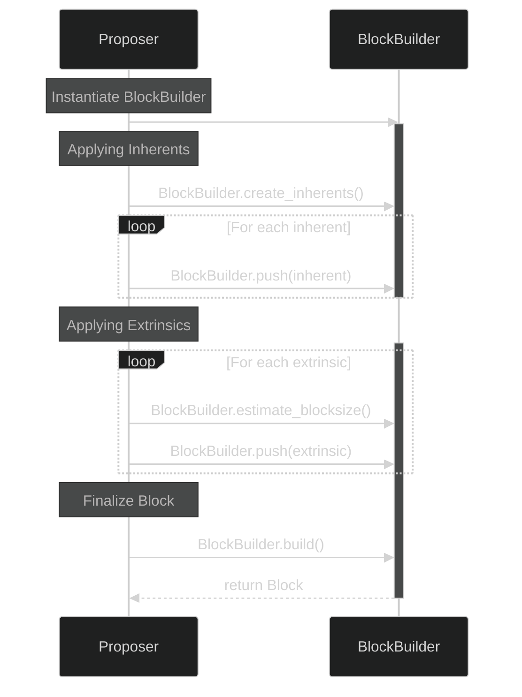
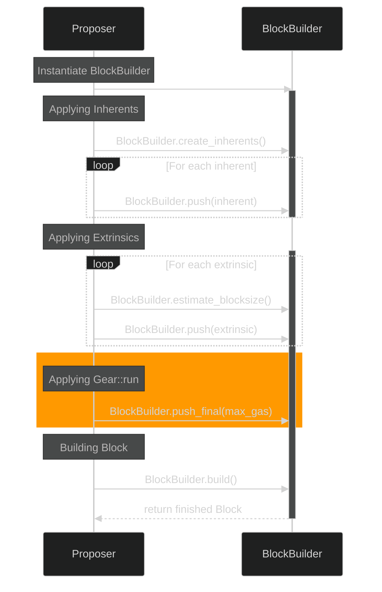

# Block Authoring in Vara Network
## 1. Introduction

**Vara Network** is a standalone Layer 1 decentralized network built on top of Gear Protocol, which is itself based on Substrate. In this article, we will explore how Gear Protocol's custom block authoring implementation differs from the native Substrate implementation and how this important enhancement allows for Gear's message queue feature, a core component of Gear's [Actor model](https://wiki.gear-tech.io/docs/gear/technology/actor-model/). We will begin by examining Substrate's block authoring process and then move on to how it is implemented in Gear Protocol.

## 2. Block Authoring with Substrate
### 2.1 The `BlockBuilder` Utility
The `BlockBuilder` utility is used by the `Proposer` in the Substrate node as an abstraction over the runtime API to initialize a block, push transactions, and finalize a block. In Substrate, transactions are referred to as extrinsics, which include signed transactions, unsigned transactions, and inherent transactions. The `Proposer` leverages the `BlockBuilder` to orchestrate the block production process, ensuring extrinsics are managed and applied correctly, and the block is constructed and finalized properly. Inherent transactions, typically just referred to as inherents, are a special type of unsigned transaction that allows block authoring nodes to add information directly to a block. The block authoring process with the `BlockBuilder` utility is depicted in the diagram below in a slightly simplified form.


The important steps where the `Proposer` interacts with the `BlockBuilder` are:

1. **Initialize BlockBuilder**: The `Proposer` initializes a `BlockBuilder` with references to the runtime API and necessary state information.
2. **Applying Inherents**: Inherent extrinsics are created using the `create_inherents` method and added to the new block using `push`.
3. **Applying Extrinsics**: The `Proposer` then iteratively adds extrinsics from the transaction pool to the block. The `BlockBuilder` interacts with the runtime API to apply each extrinsic to the blockchain state by calling methods like `apply_extrinsic`. This ensures each extrinsic can be validly executed before including it in the new block. During this process, the `Proposer` uses the `BlockBuilder`'s `estimate_blocksize` method to monitor the current size of the block. The `Proposer` stops adding extrinsics if the block size approaches the block size limit or if the consensus deadline is near.
4. **Finalize Block**: The block is finalized using the `build` method, which completes the block construction and produces the final block structure ready for inclusion in the blockchain.
### 2.2 Time and Size Constraints
When the `Proposer` authors a block using the `BlockBuilder` in Substrate, two key constraints need to be managed: the consensus deadline and the block size limit.

The consensus deadline ensures that a block is proposed within a specific timeframe to maintain the overall pace of block production and synchronization across the network. During the block production process, the `Proposer` monitors the time and ensures that the block is finalized and submitted before the deadline. Additionally, a soft deadline is used as a secondary timing mechanism to decide when to stop attempting to include more extrinsics in a block. The soft deadline is calculated as a percentage of the remaining time until the consensus deadline, providing some flexibility in extrinsics inclusion. This buffer period allows the `Proposer` to include a few more extrinsics, even if some have been skipped due to size constraints. In this way, the soft deadline ensures that blocks are efficiently filled while adhering to the overall time constraints imposed by the consensus protocol.

The block size in Substrate is measured in units of `weight`. One unit of weight is defined as one picosecond ($10^{-12}$ seconds) of execution time on reference hardware. The total block size limit is further structured by introducing a `DispatchClass` for extrinsics:
```rust
pub enum DispatchClass {
    Normal,
    Operational,
    Mandatory,
}
```
The runtime constant `NORMAL_DISPATCH_RATIO` is set to $80\\%$ by default, meaning that $80\\%$ of the block weight should be comprised of extrinsics of type `DispatchClass::Normal`. The remaining $20\\%$ can be used by extrinsics of type `DispatchClass::Operational` and `DispatchClass::Mandatory`.

Both time and block size (i.e., weight) constraints are related because weight is defined as units of computation per time. Therefore, theoretically, it is possible to measure time in terms of weight, and vice versa. However, in practice, this relationship is not perfect, and both approaches are needed together to maintain consistent block production.

## 3. Block Authoring with `Gear Protocol`
### 3.1 Custom `BlockBuilder` Implementation
In Gear Protocol, there exists a special inherent called `Gear::run` (also known as the pseudo-inherent), responsible for processing Gear's message queue. In Gear Protocol, messages serve as the primary interface for communication between actors (users and programs). Each Gear program includes code to handle incoming messages. During message processing, programs can send messages to other programs or users, including replies to the original message. Gear nodes maintain a global message queue. Users can send transactions containing one or more messages to specific programs via a Gear node, which populates the message queue. During block authoring, messages are dequeued and delivered to their respective programs by `Gear::run`.

The `Gear::run` pseudo-inherent must be added at the end of each block after all other extrinsics have been pushed. To accommodate these requirements, Gear Protocol extends Substrate's `BlockBuilder` and `Proposer` implementations. The diagram below highlights the changes in the block authoring workflow compared to Substrate's native implementation.


Including the `Gear::run` inherent in the block is achieved through a new method called `push_final`, which retrieves the pseudo-inherent using the runtime API and appends it to the end of the block's list of extrinsics.

```rust
pub fn push_final(&mut self, max_gas: Option<u64>) -> Result<(), Error>

```

### 3.2 Changes to the Block Structure

Since processing the message queue takes a considerable amount of time, Gear Protocol's block design is adjusted to accommodate this by altering the ratio of extrinsics included in a single block.

Specifically, the `NORMAL_DISPATCH_RATIO` runtime constant is changed from $80\\%$ to $25\\%$, allowing up to $25\\%$ of the block weight to be filled by extrinsics of type `DispatchClass::Normal`. This adjustment leaves the remaining block weight for extrinsics of `DispatchClass::Mandatory` and `DispatchClass::Operational`. However, since there are no `DispatchClass::Operational` extrinsics in Gear Protocol, `Gear::run` can effectively utilize up to $75\\%$ of the block's total weight.


In general, we aim to allow `Gear::run` to occupy this $75\\%$ of the total block. Therefore, an additional constant `DEFAULT_GAS_ALLOWANCE` for `Gear::run` is introduced, which accounts for this in units of gas (another representation of weight):
```rust
pub const DEFAULT_GAS_ALLOWANCE: u64 = 750_000_000_000;
```

### 3.3 Deadline Slippage and `max_gas` Parameter
Since `Gear::run` assumes it has $75\\%$ of the block's weight available, a mismatch between the used weight and the actual elapsed time could prevent `Gear::run` from completing within the current block. In this scenario, the pseudo-inherent would need to be dropped from the current block.

To address this, the goal is to provide `Gear::run` with a realistic approximation of the remaining time available during the block authoring slot. This is achieved by introducing a `max_gas` parameter, which adjusts for the remaining time in units of gas, as opposed to the `DEFAULT_GAS_ALLOWANCE` constant.

Additionally, a `deadline_slippage` parameter is introduced, which acts as a "relaxed" version of the `NORMAL_DISPATCH_RATIO` runtime constant. By default, Substrate allocates $1/3$ of the slot duration for block finalization. Since this time is rarely fully utilized, it is possible to exceed the hard deadline to some degree. For example, a `deadline_slippage` of $10\\%$ would allow applying extrinsics for $35\\%$ of the block proposal duration. This way, `Gear::run` can still execute for $75\\%$ of the original proposal duration while exceeding the hard deadline by at most $10\\%$.
## 4. Conclusion
In summary, the custom block authoring in Gear Protocol utilizing the `Gear::run` pseudo-inherent provides substantial enhancements to Substrate, with efficient asynchronous messaging and delayed contract execution being just two examples. These advancements open up new and exciting possibilities for dApp development, which users can explore on [Vara Network](https://vara.network/).