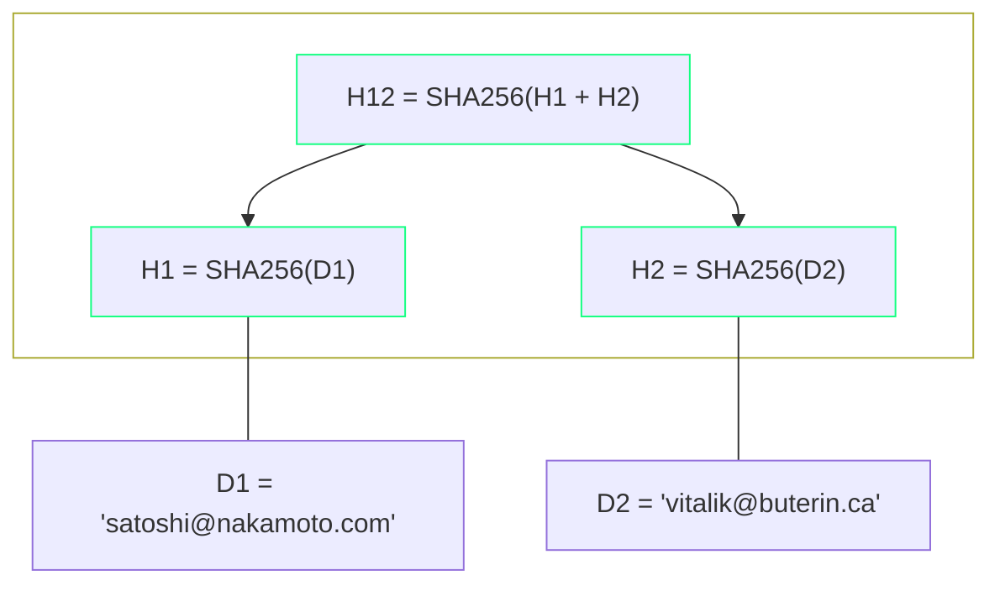
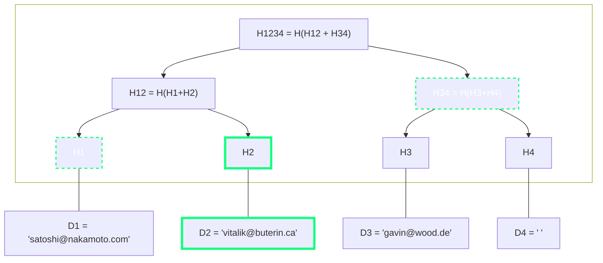
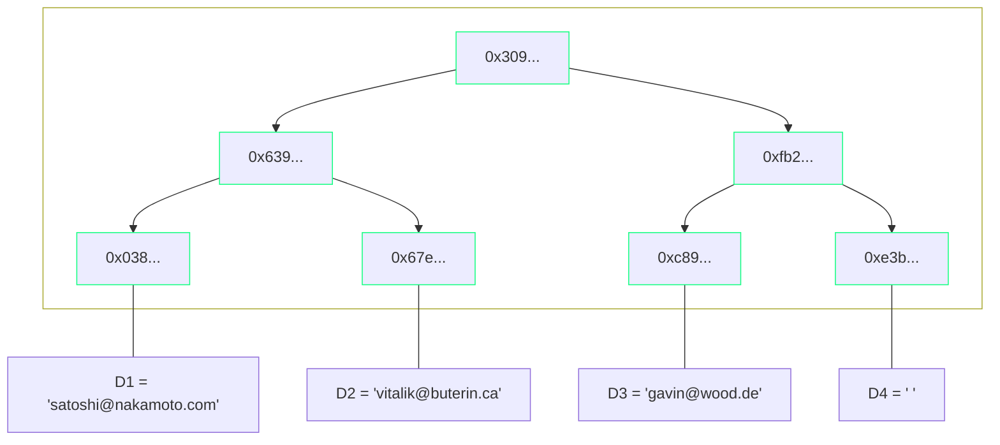

In this article, we'll explore Merkle trees and Merkle proofs, covering how they work, their role in blockchain systems, and how to build them with a focus on both theory and practical examples.

## 1. Introduction to Merkle Trees
A Merkle tree is a hash-based data structure constructed from arbitrary data using a fixed hash function $H$. The primary advantage of this data structure is that it enables us to prove the inclusion of a certain piece of data in the tree without needing to store the data itself. This is possible through the clever use of a hash function combined with a tree structure. A hash function accepts input of arbitrary length and consistently produces a unique fixed-length string, meaning that two different pieces of data will always yield two distinct hashes. In what follows, we will focus on binary Merkle trees, where each node can have at most two children.

Before delving into the general construction process of Merkle trees, let's examine a minimal example. The diagram below illustrates a Merkle tree created using the strings `satoshi@nakamoto.com` and `vitalik@buterin.ca` with the `SHA-256` hash function. This specific Merkle tree contains only three nodes: two leaves and one root node.


The leaf nodes of this Merkle tree are formed by hashing the strings $D_1$ and $D_2$ using the `SHA-256` hash function. The root node $H_{12}$ is derived by concatenating these two hashes and hashing the result again. It's important to note that the actual data, specifically the strings $D_1$ and $D_2$, are not included in the tree; only their hashes are.

The root hash represents the entire set of leaf nodes and is a cryptographic commitment to the initial data set. If we would change just a single symbol of one of the input strings this would result in different leaf hashes and thus in a different root hash. This simple example already encapsulates the general construction procedure of a Merkle tree:

1. **Start with Leaf Nodes**: We begin by hashing the data to obtain a list of hash values. These hashes serve as the leaf nodes of the Merkle tree.
2. **Pair and Hash**: We pair each leaf node with its sibling. For every such pair, we concatenate their hash values and hash the resulting value. This process yields the parent nodes at the next level of the tree. If a leaf node does not have a sibling, which happens when the number of leaf nodes is odd, we either duplicate that lone leaf or insert a leaf with a default value. This adjustment ensures an even number of nodes for pairing. Although not essential for Merkle proofs, this method is typically employed to enhance the efficiency of the data structure.

This pairing and hashing process is repeated for each level of the tree until we reach the top of the tree. This single hash is the root of the Merkle tree.

## 2. Merkle Proofs for Whitelists
A Merkle proof is a set of hashes that can be used to verify that a specific leaf is part of a Merkle tree. By utilizing the leaf hash and the hashes from the Merkle proof, we can recompute the Merkle root. This recomputed root is then compared to the publicly available Merkle root of the tree, confirming the inclusion of the leaf in the tree.

A common use of Merkle trees in Web3 is maintaining whitelists, where users may be granted privileges, such as NFT minting, based on prior selection. In this scenario, unique user data must be stored in the whitelist. While real-world applications often use account addresses for this purpose, we'll simplify by extending our introduction example using email addresses. Let's assume that our whitelist consists of the following three email addresses: `satoshi@nakamoto.com`, `vitalik@buterin.ca` and `gavin@wood.de`.


**Example**: The leaves $H_1$ through $H_3$ of this Merkle tree are obtained by hashing the email addresses of our whitelist. Additionally, we included $D_4$ as an empty string to keep the tree balanced. The Merkle proof for $H_2$ is given by the array of hashes $[H_{1}, H_{34}]$. Given the root $H_{1234}$ of the tree we can verify the proof as follows:
1. Compute $H'_{12}$ by concatenating and then hashing $H_1$ and $H_2$.
2. Compute $H'\_{1234}$ by concatenating and then hashing the previously computed $H'\_{12}$ with $H_{34}$.
3. Compare $H_{1234}$ with the computed $H'_{1234}$. If the hashes are equal, the proof is valid; otherwise, it is invalid.

If we want to obtain a Merkle proof for $H_3$ instead, then the necessary hashes are $H_4$ and $H_{12}$.

Recalling our introductory example from the previous section, where we created a Merkle tree using only two email addresses, we can now see how a Merkle proof is formed for the inclusion of one of these addresses in the tree. A Merkle proof for the inclusion of $D_1$ requires only the hash $H_2$, analogously the proof for $D_2$ requires knowledge of $H_1$. 

In general, we can obtain a Merkle proof by starting from the selected leaf and moving up the tree. At each level, we select the sibling node and add it to the proof list. The sibling node is necessary because it provides the information needed to reconstruct the parent node at each step. We continue this process of moving up the tree, selecting sibling nodes at each level, until we reach the root of the Merkle tree. The collection of these sibling nodes forms the Merkle proof.

The significant advantage of this approach in Web3 applications is that only the Merkle root needs to be stored on-chain, whereas the actual tree can be stored off-chain in a backend. A smart contract can then be used to verify a proof for a specific leaf. This is crucial, as block space is typically a costly resource.

## 3. JS Implementation using `merkletreejs`
**Prerequisites**: Node.js, npm

In this section, we will use the JavaScript library `merkletreejs` to implement a Merkle tree for email whitelisting. Specifically, we will demonstrate how to construct a Merkle tree using three email addresses and how to obtain and verify the corresponding Merkle proofs.

First, create a new folder, initialize a new Node.js project using npm, and install `merkletreejs` along with `crypto-js`:
```bash
npm init -y
npm install merkletreejs crypto-js 
```

Next, create an empty file named `merkle.js` and paste the following JavaScript code:
```Javascript
const { MerkleTree } = require('merkletreejs')
const SHA256 = require('crypto-js/sha256')

// Sample data
const leaves = ['satoshi@nakamoto.com', 'vitalik@buterin.ca', 'gavin@wood.de', ''].map(x => SHA256(x))

// Initialize the Merkle Tree
const tree = new MerkleTree(leaves, SHA256, {
    sortPairs: true
})

// Log the tree
console.log('Merkle tree:\n', tree.toString());
```
This code snippet implements the scenario described earlier, where we construct a Merkle tree using email addresses as input data. Notice that we have also included an empty string in the `leaves` array to balance the tree. We use the `SHA256` function from `crypto-js` to generate the leaves from our data, which forms the foundation of the Merkle tree. Then, we initialize a new Merkle tree by invoking the `MerkleTree` constructor from `merkletreejs`, passing in our `leaves` array and the `SHA256` hash function. Additionally, we need to set the `sortPairs` flag to `true` to enable hexadecimal proof verification.

Running `node merkle.js` will log the newly created Merkle tree to the console:
```bash
Merkle tree:
 └─ 3091e77ff091717dbc4c42aaa48ed37c3da445916e86a19466a38eee2f74cb28
   ├─ 639983b835d9c5320b34589e9523d2859bb99f91a2f81caea526a6ed03567150
   │  ├─ 038a33cbcf36f6fe7f270188fc4cd48087cd6dddc2120d39d5e225191676183e
   │  └─ 67e7a3cbbe8c4dd8bd640170dcf45b7181aa7b73c03a3449df2fbe392e494501
   └─ fb228476e81f4e4edd4b9d5ed03ed5b54cf37e9098e3835ae6df6b92410a78f3
      ├─ c89a41f732b7981100fcc6bec235c83aec0e1674c692dc475b226ee56a4aea76
      └─ e3b0c44298fc1c149afbf4c8996fb92427ae41e4649b934ca495991b7852b855
```
This output corresponds to the following tree diagram:

To verify if the email address `vitalik@buterin.ca` is included in the Merkle tree, we can use the `getHexProof` method from the `tree` object to obtain a Merkle proof in hexadecimal format. For this, we only require the hash of the address. Append the following lines to your existing code:
```Javascript
// Get the Merkle proof for 'vitalik@buterin.ca'
const leaf = SHA256('vitalik@buterin.ca');
const proof = tree.getHexProof(leaf);

// Output the proof
console.log('Merkle Proof for "vitalik@buterin.ca":', proof);
```
Executing `node merkle.js` again will print the Merkle proof for `vitalik@buterin.ca` to the console:
```bash
Merkle Proof for "vitalik@buterin.ca": [
  '0x038a33cbcf36f6fe7f270188fc4cd48087cd6dddc2120d39d5e225191676183e',
  '0xfb228476e81f4e4edd4b9d5ed03ed5b54cf37e9098e3835ae6df6b92410a78f3'
]
```
Since the address `vitalik@buterin.ca` is represented by the second leaf node from the left, we can visually verify, using the previous diagram, that these hashes are precisely what's needed for a valid Merkle proof. To confirm the proof's validity, we use the `verify` method of the `tree` object. Add the following lines to your code and execute `node merkle.js` once more:
```Javascript
// Get the root of the tree
const root = tree.getRoot().toString('hex');

// Verify the proof for 'vitalik@buterin.ca'
console.log(tree.verify(proof, leaf, root)) // true
```
As expected, the proof verification is successful. To understand what happens when we try to obtain and verify a proof for an email not included in the Merkle tree, let's add the following lines:
```Javascript
// Get the Merkle proof for non-existing 'bitalik@buterin.ca'
const badleaf = SHA256('bitalik@buterin.ca');
const badproof = tree.getHexProof(badleaf);

// Output the proof
console.log('Merkle Proof for "bitalik@buterin.ca":', badproof);

// Verify the proof for 'bitalik@buterin.ca'
console.log(tree.verify(badproof, badleaf, root)) // false
```
This results in an empty proof and, consequently, verification fails:
```bash
Merkle Proof for "bitalik@buterin.ca": []
false
```